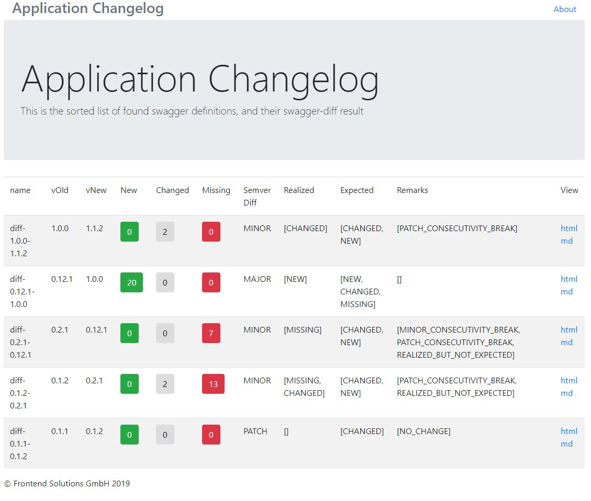

# UFP SWAGGER DIFF Docker

this repository creates a docker images that takes an folde rof json swagger definitions and compares them, and prints out an overview of all analysed swagger api definition. additionaly a live url can be configured to check against, which can be used in integration testing for api conformity

            
 # Usage
 
 	ufp-swagger-diff:
        image: frontendsolutions/ufp-swagger-diff:${VERSION}
        environment:
          - CFG_VALIDATE_URL=http://nginx-swagger:80/petstore-v0.1.1.json
          - CFG_VALIDATE_URL=http://localhost/v2/api-docs?group=ufp-api
          - CFG_VALIDATE_REFERENCE_VERSION=latest
          - CFG_INPUT_FOLDER=/ufp-swagger-diff/input
          - CFG_OUTPUT_FOLDER=/ufp-swagger-diff/output 
          - CFG_HTML_TITLE=Application Changelog
          - CFG_HTML_TITLE=Application Ref Changelog
          - CFG_DIFF_HTML_CSS=defaultCSS.css

        volumes:
          - ./petstore:/ufp-swagger-diff/input
          - ./report:/ufp-swagger-diff/output

# Development

it used sidt.sh infrastructure, build jiar using

	./maven.sh clean install
	
after that build docker images

	./sidt.sh -m service
	
	
bring up test stack

	./stack.sh -u debug
	./stack.sh -u infra
	./stack.sh -u service
	./stack.sh -u test
	
	
